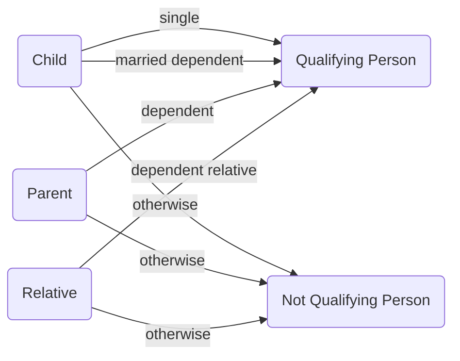

- [Qualifying Person](https://www.irs.gov/publications/p17#en_US_2024_publink1000170821)
- [Relatives who don't have to live with you](https://www.irs.gov/publications/p17#en_US_2024_publink1000170951)
- [Qualifying Child](https://www.irs.gov/publications/p17#en_US_2024_publink1000170876)
- [Qualifying Relative](https://www.irs.gov/publications/p17#en_US_2024_publink1000170933)
- [Support Worksheet](https://www.irs.gov/publications/p17#en_US_2024_publink1000171012)

Dependents impact a taxpayer's filing status and potential [[Tax Credits]] on the return

## Qualifying Child

There are 5 tests that define a qualifying child:

- Relationship
	- Son, daughter, stepchild, foster child or descendant of any of them
	- or brother, sister, half/step-sibling or descendant of any of them
- Age
	- Under age ==19== on Dec 31 and younger than the taxpayer (or spouse)
	- or a student under ==24==
		- Must be full-time during some part of any 5 calendar months
	- or permanently and totally disabled at any age
- Residency
	- In general, more than half the year
	- Exceptions for temporary absences, children born or who died during the year, children of divorced parents etc.
- Support
	- The child must not have provided over half of their own support
- Joint Return
	- The child cannot have filed a joint return
	- **except** for the purposes of claiming a refund on withholding or estimated tax

## Qualifying Relative

There are 4 criteria that must be met to be a qualifying relative:

- Not a Qualifying Child
- Member of household or relationship test
	- Lives with the taxpayer **all year**
	- or related via _Relatives who don't have to live with you_ 
- Gross income test
	- Less than ==$5,050==
- Support test
	- Must have paid more than half the support for the dependent
	- Numerous exceptions including Multiple Support Agreements

## Qualifying Person

There are three categories (really two with an specialized case of qualifying relative) of dependents. A qualifying person is part of the criteria for the [[Filing Status#Head of Household]] status.

### Qualifying Child Test

A child that has lived with the taxpayer for more than half the year **and** is either **single** or can be claimed as a **dependent**.

### Qualifying Relative Test

Either a taxpayer's **dependent parent** or a  **qualifying relative** satisfying one of the relationships in _Relatives that don't have to live with you_ who can be claimed as a **dependent**

## Children of Divorced or Separated Parents

A child may qualify as a dependent of more than one person, such as when parents are divorced, never married, or legally separated. **Only one** taxpayer may claim a dependent on a given year's tax return.

- A **custodial** parent is the parent with whom the child stayed for the greatest number of **nights**.
- Unless a divorce agreement (pre-2009) or 8332 states otherwise the custodial parent can claim the dependent
	- If neither is custodial, the higher AGI parent can claim

### Tiebreaker Rules

When more than one (biological or adoptive) parent or guardian can claim a dependent, tiebreaker rules are applied to determine who gets to claim them as a qualifying child.

- If only one person is the child's parent, the person is treated as their qualifying child
- If the parents file a joint return, the child is treated as both parents' qualifying child
- If filing separately, the **custodial parent** can claim the child
- If no parent can claim the child, they are treated as the qualifying child of the person with the **highest AGI**
- If a parent _can_ claim the child but no parent _does_, the person with the highest AGI **exceeding** that of the parents may claim them as a qualifying child.