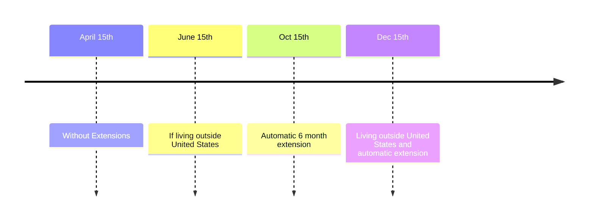

- [Publication 17](https://www.irs.gov/publications/p17)
- [Filing Requirements](https://www.irs.gov/publications/p17#en_US_2024_publink1000170407)
- [Dependent Filing Requirements](https://www.irs.gov/publications/p17#en_US_2024_publink1000170407)
- [Automatic Filing Requirements](https://www.irs.gov/publications/p17#en_US_2024_publink1000284899)

## Who must file?

- Citizens and resident Aliens who meet the [[Filing Requirements and Due Dates#Filing Requirements]]
- Non-residents 
	- TODO

## Deadline to File

The deadline to file without extensions is April 15th or the following business day.

### Extensions

- **automatic** 6-month extension if filing form [[4868]]
- Living outside the US: 2 month extension + automatic extension if filed
- Combat zone: Extended 180 days after the later of
	- day in combat zone
	- qualified hospitalization

> NOTE: An extension to **file** is **not** an extension to **pay**.

## Filing Requirements

It is generally a good idea to file even if you don't strictly meet the requirements for record-keeping purposes and to receive a refund of any withheld tax. For most taxpayers, the [[Types of Income#Gross Income]] requirements based on [[Filing Status]] are most pertinent, but certain [[Filing Requirements and Due Dates#Special Conditions]] require filing irrespective of income. 

### Income Requirements

|Filing Status     |Age     |Income |
|----------------- |--------|-------|
|S|< 65|$14,600|
||> 65|$16,550|
|MFJ|< 65 (both)|$29,200|
||< 65 (one)|$30,750|
||< 65|$14,600|
|MFS|any|$5|
|QSS|< 65|$29,200|
||< 65|$30,750|

> The income requirements are generally based on the standard deduction, since taking that deduction would result in $0 tax owed regardless.

### Dependent Filing Requirements

Dependent filing requirements depend on marital status and whether the tax payer is blind. A taxpayer must file if *any* of the following apply:

- Single
	- < 65 and not Blind
		- Unearned Income > ==$1,300==
		- Earned Income > ==$14,600==
		- Gross Income > `max(1300, Earned + 450)`
	- > 65 or Blind
		- Unearned Income > ==$3,250 ($5,200 if both)==
		- Earned Income > ==$16,550==
		- Gross Income > `max(3250 (5200 if both), Earned + 2400 (4350 if both))`
- Married
	- < 65 and not Blind
		- Unearned Income > ==$1,300==
		- Earned Income > ==$14,600==
		- Gross Income > `max(1300, Earned + 450)`
		- Gross Income > ==$5== for MFS and **itemizing**
	- > 65 or Blind
		- Unearned Income > ==$3,250 ($5,200 if both)==
		- Earned Income > ==$16,550==
		- Gross Income > `max(3250 (5200 if both), Earned + 2400)`

### Special Conditions

The following special circumstances require a taxpayer to file even if they otherwise do not meet the gross income requirements.

1. Special Taxes
	1. [[Alternative Minimum Tax]]
	2. Tax on retirement account, qualified plan etc.
	3. Household employment taxes
	4. Unreported SS and Medicare
	5. Uncollected SS, Medicare or RRTA tax
2. [[Health Savings Accounts|HSA]] distributions
3. [[Self-Employment]] earnings exceeding ==$400==
4. ==$108.28== from tax-exempt church organization
5. Advanced payments of premium [[Tax Credits]]
	> See form [[1095-A]]
6. Income under Section 965
7. Clean Vehicle [[Tax Credits]]